<div align="center">

# MicroMart

**An event-driven e-commerce platform built as microservices — REST at the edge, gRPC inside, and a choreographed saga for checkout.**


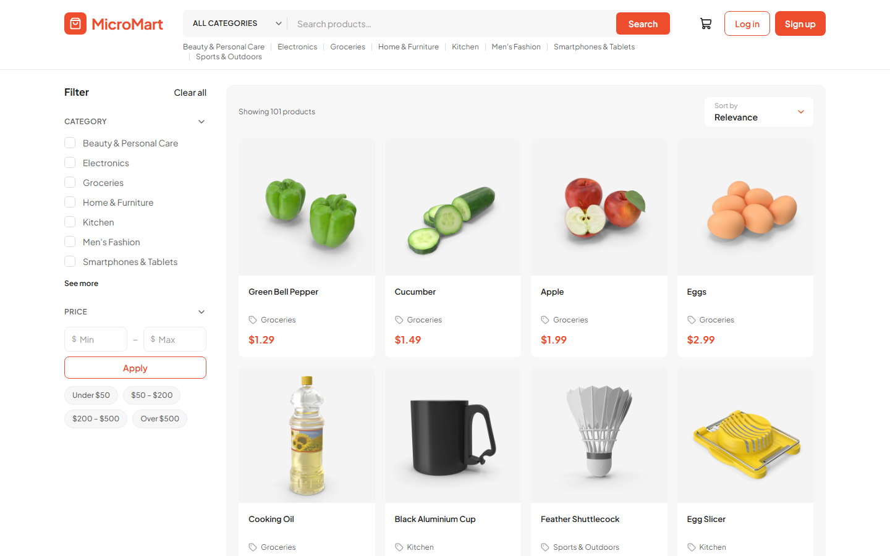

</div>

---

## Highlights

- **Six independently deployable services** — API Gateway, Auth, Catalog, Order, Payment and Notification — each owning its own PostgreSQL database. No service ever reads another's tables.
- **Choreographed saga checkout** — Order, Catalog and Payment coordinate purely through RabbitMQ events, with **automatic compensation**: if payment fails, reserved stock is released; if stock runs out, nothing is charged.
- **Exactly-once effects on at-least-once delivery** — every consumer is idempotent (Redis `SET NX` fast-path + database unique constraints as the real guarantee), so redelivered events never double-reserve or double-charge.
- **No overselling** — stock is reserved with an atomic conditional `UPDATE`, safe under concurrent checkouts.
- **REST → gRPC gateway** — one public REST API with Zod validation, JWT auth, role-based access and Redis-backed rate limiting shared across replicas.
- **Full-text product search** on Elasticsearch with category, price-range and sort filters.
- **Product photos in S3-compatible object storage** — 1–5 images per product, validated by file signature (not extension), uploads rolled back if the database write fails. Runs on SeaweedFS locally and AWS S3 / R2 in production with config changes only.
- **Secure auth** — bcrypt hashing, short-lived access tokens, rotating + revocable refresh tokens, and account lockout after repeated failed logins.
- **Responsive marketplace frontend** in Next.js with a live order-status timeline, cart, wallet and an admin console.
- **Measured, not guessed** — automated k6 load tests with pass/fail thresholds (see [Performance](#performance)).

## Architecture

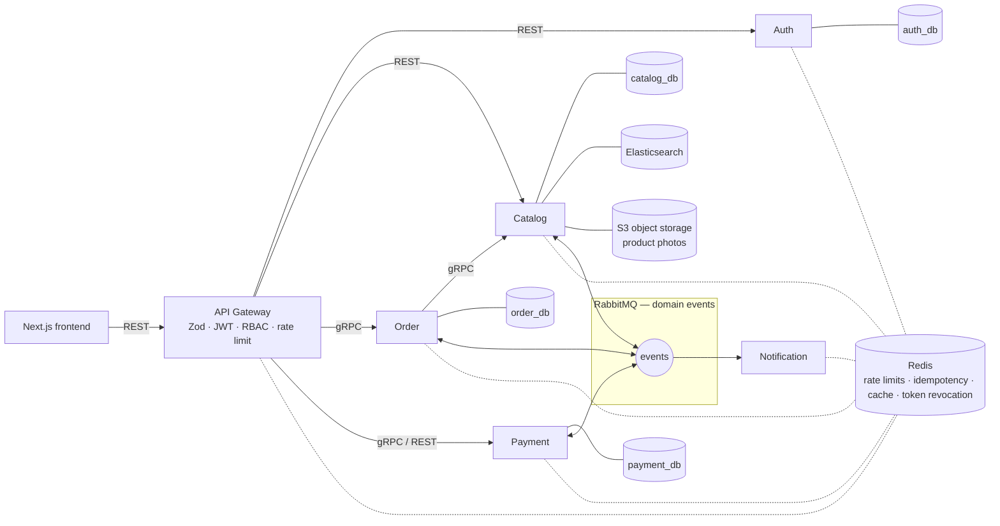

### Checkout saga

There is no central orchestrator — each service reacts to the previous event and publishes its own outcome.

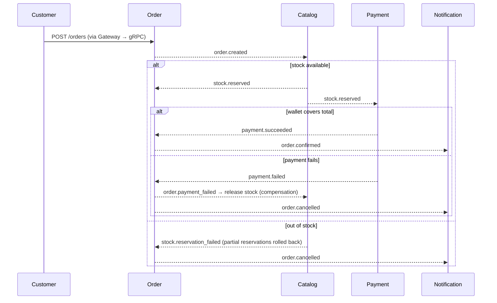

Order keeps an append-only `saga_events` log of every event it publishes and consumes — the single place to reconstruct what happened to any order.

## Screenshots

| Product page with photo gallery | Live order status |
|---|---|
| 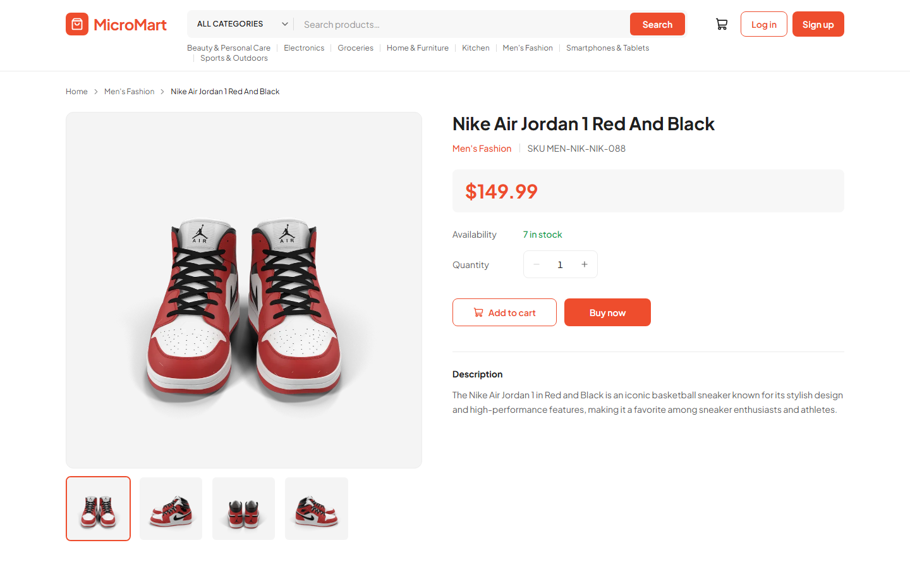 | 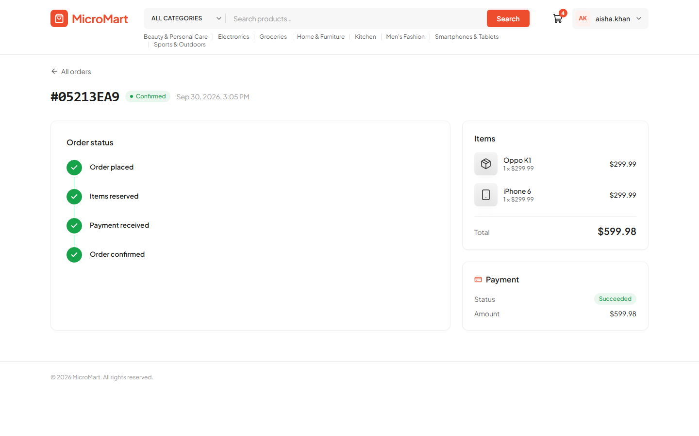 |
| **Cart** | **Category filtering** |
| 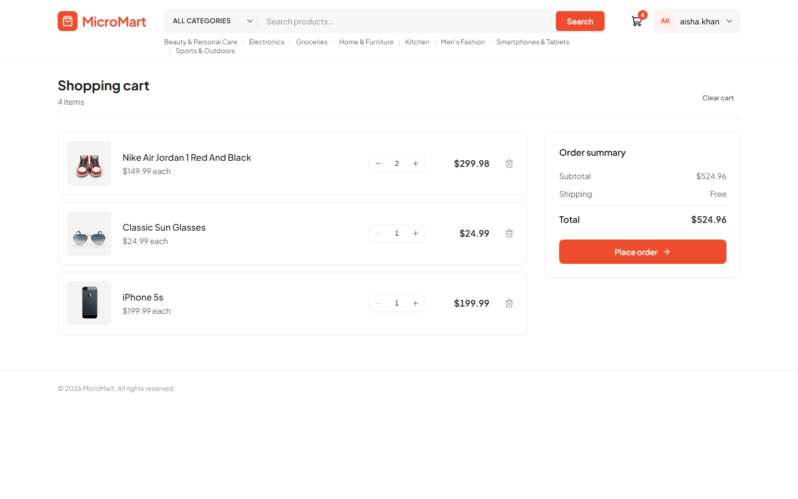 | 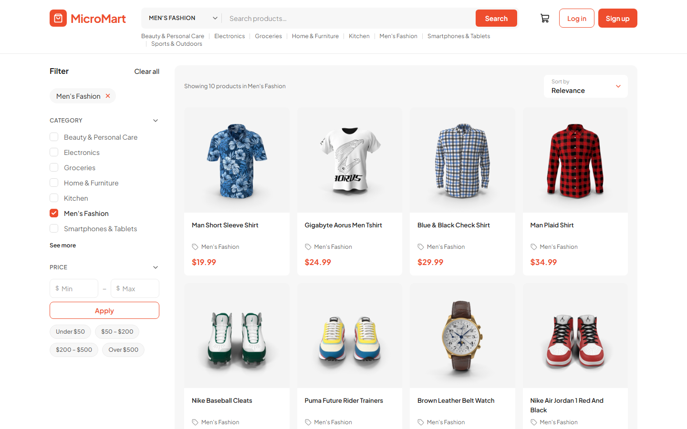 |
| **Admin console — products with photo upload** | **Validation on every form** |
| 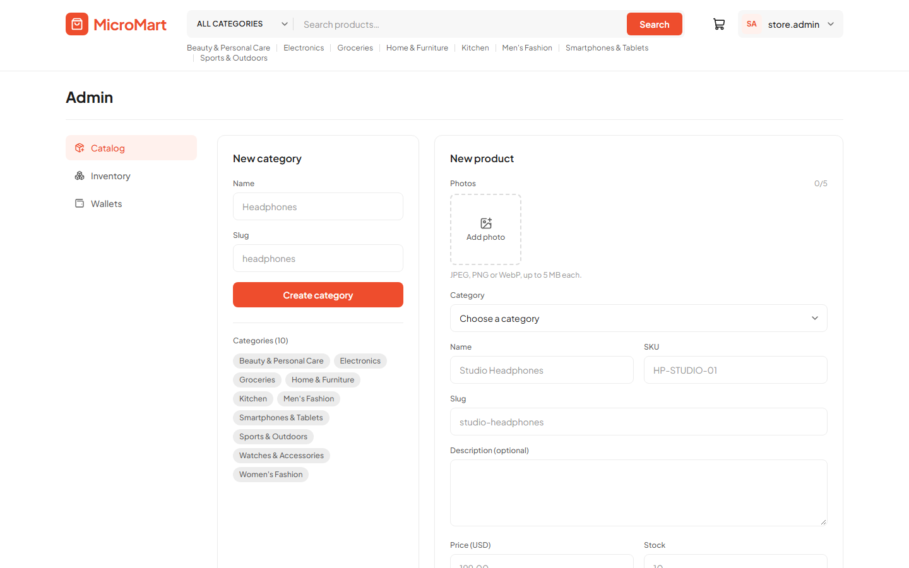 | 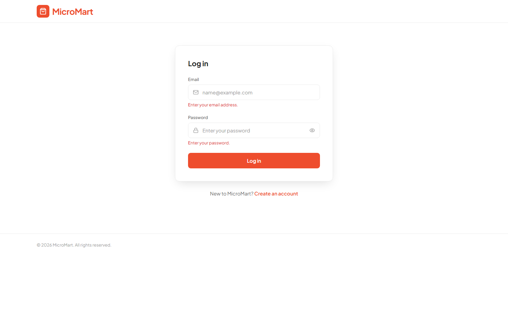 |

<p align="center">
  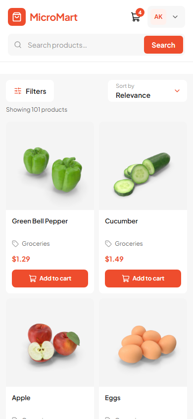
  &nbsp;
  
  &nbsp;
  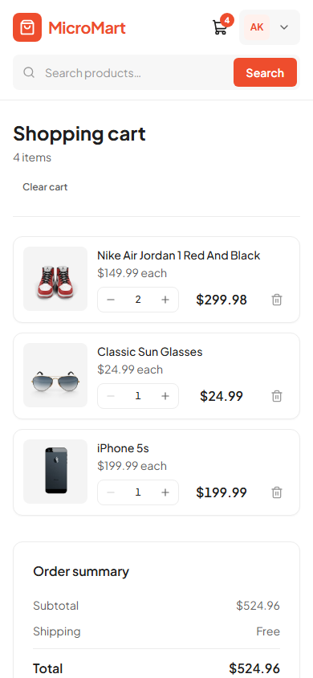
</p>

## Services

| Service | Responsibility | Talks via | Owns |
|---|---|---|---|
| **Gateway** | Public REST API, validation, JWT, RBAC, rate limiting | REST in; REST + gRPC out | — |
| **Auth** | Registration, login, refresh-token rotation, lockout | REST, gRPC | `auth_db` |
| **Catalog** | Categories, products, photos, search, stock reservation | REST, gRPC, events | `catalog_db`, Elasticsearch, object storage |
| **Order** | Orders, price snapshots, saga state + audit log | gRPC, events | `order_db` |
| **Payment** | Wallets, idempotent charging | REST, gRPC, events | `payment_db` |
| **Notification** | Order confirmation / cancellation notices | events only | `notification_db` |

## Tech stack

| Area | Technology |
|---|---|
| Language | TypeScript (end to end) |
| Services | NestJS on Fastify |
| Frontend | Next.js (App Router), React, Tailwind CSS |
| Service-to-service | gRPC with shared protobuf contracts (`proto/`) |
| Messaging | RabbitMQ |
| Data | PostgreSQL + Prisma (one database per service) |
| Search | Elasticsearch |
| Cache / limits / idempotency | Redis |
| File storage | S3-compatible (SeaweedFS locally, AWS S3 / R2 in production) |
| Validation | Zod — on the client and at every service boundary |
| Observability | OpenTelemetry → Tempo, Prometheus, Loki, Grafana |
| Delivery | Docker, Docker Compose, PM2, GitHub Actions |
| Load testing | k6 |

## Engineering decisions

- **Database per service.** Cross-service references (like an order's `user_id`) are plain UUIDs with no foreign keys — consistency comes from events, which is what lets each service deploy and scale on its own.
- **Choreography over orchestration.** Services stay decoupled; the trade-off (no single place to see the flow) is covered by Order's append-only saga log.
- **Idempotency in two layers.** A Redis `SET NX` check skips duplicate events cheaply; unique constraints (`payments.order_id`, reservations per `(order_id, product_id)`) are the actual guarantee.
- **Price snapshots.** Order lines store the name and price at purchase time, so catalog edits never rewrite order history.
- **Rate limits in Redis, not memory.** Counters are shared, so running several gateway replicas doesn't multiply the allowed rate.
- **Uploads are validated by content.** File type comes from magic bytes, never the client's extension or MIME type; object keys are random and immutable, so images can be cached forever and served from a CDN.

## Performance

Automated with k6 ([`loadtest/`](loadtest/)) against read-heavy shopper traffic, on a single 4-core laptop running every service, database and the load generator itself:

| Offered load | Errors | Median latency |
|---|---|---|
| up to ~340 req/s | 0% | 10–25 ms |
| ~480 req/s | 0% | 140–585 ms |
| 545+ req/s | rising | seconds |

The single-process gateway is the first bottleneck; the next steps are gateway replicas behind a load balancer and caching public listings. The per-IP rate limiter was verified to reject abusive clients in ~2 ms.

## Getting started

**Prerequisites:** Node.js 24+, Docker Desktop, and PostgreSQL running locally with the five databases from [Full-System-Setup.md](Full-System-Setup.md#11-create-the-five-databases).

```powershell
# 1. Infrastructure: Redis, RabbitMQ, Elasticsearch, object storage, observability
cd infra
docker compose up -d
cd ..

# 2. Each service: configure, install, migrate
#    (repeat for auth, catalog, order, payment, notification)
cd services/auth
Copy-Item .env.example .env        # set DATABASE_URL and a shared JWT_SECRET
npm install
npx prisma migrate deploy
npm run prisma:generate
cd ../..

# 3. Gateway and frontend
cd gateway;  Copy-Item .env.example .env; npm install; cd ..
cd frontend; Copy-Item .env.example .env; npm install; cd ..

# 4. Start everything — one window per service, plus the frontend
.\start-dev.ps1

# 5. Optional: demo data — 25 users and 100 products with photos
node seed/seed.mjs
```

Open **http://localhost:3006**. The full walkthrough, port map and troubleshooting are in [Full-System-Setup.md](Full-System-Setup.md).

## Project structure

```
MicroMart/
├── gateway/              API gateway (REST → REST/gRPC)
├── services/
│   ├── auth/             users, tokens, lockout
│   ├── catalog/          products, photos, search, stock
│   ├── order/            orders + saga log
│   ├── payment/          wallets + charging
│   └── notification/     event-driven notices
├── frontend/             Next.js storefront + admin console
├── proto/                shared gRPC contracts
├── infra/                Docker Compose, Nginx, Prometheus, Tempo, object storage
├── loadtest/             k6 scenarios + one-command runner
├── seed/                 synthetic demo data
└── .github/workflows/    CI pipeline
```

## Testing

```powershell
cd services/catalog; npm test          # unit tests per service
.\loadtest\run.ps1 -Profile smoke       # quick end-to-end health check
.\loadtest\run.ps1 -Profile stress      # find the breaking point
```

CI runs lint, unit tests, end-to-end tests and a build for the gateway and every backend service on each push.

## Roadmap

- Gateway response caching and horizontal scaling behind a load balancer
- Edit and delete product photos; resized variants served via CDN
- Real payment provider and email delivery behind the existing interfaces
- Frontend in the CI pipeline and end-to-end browser tests
